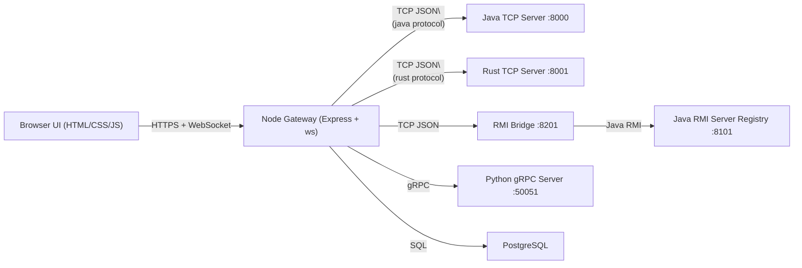

# Interlink Cross-Language Chat

A multi-protocol chat system that demonstrates interoperability across language runtimes and transport stacks behind a single authenticated web client.

The project combines:
- A Node.js web gateway and frontend (`ClientServer/node-frontend`)
- Multiple backend chat servers implemented in different languages
- JWT authentication and PostgreSQL persistence
- Docker-based orchestration for local interoperability demos

## What This Project Demonstrates

1. One browser client can drive multiple backend implementations without changing UI behavior.
2. Backend protocol differences are normalized by the Node gateway into a shared command model.
3. Room interactions (`CREATEROOM`, `LISTROOMS`, `JOINROOM`, `SENDMSG`) are supported over:
   - Raw TCP JSON (Java server)
   - Raw TCP JSON (Rust server)
   - Java RMI through a TCP bridge (Java RMI server + bridge)
   - gRPC (Python server)
4. Durable state (accounts, token revocation, message history) is persisted in PostgreSQL, independent of in-memory backend room state.

## 60-Second Scan (Hiring Engineer)

Why this is not a regular chat app:
- One web client switches between **four backend implementations** (`java`, `rust`, `javarmi`, `grpc`) at runtime with no UI contract change.
- A dedicated Node gateway performs protocol adaptation across **TCP JSON, Java RMI (via bridge), and gRPC**.
- Interoperability is observable in production behavior through a live trace feed (`__trace`), not just described in docs.

Hard engineering solved:
- Unified command model (`CREATEROOM`, `LISTROOMS`, `JOINROOM`, `SENDMSG`) mapped to incompatible transports.
- RMI compatibility for web workflows through `rmi_bridge.java` (TCP JSON <-> RMI + callback fanout).
- Stream/session lifecycle control for gRPC joins plus JWT-gated WebSocket upgrades and token revocation.
- Single-container orchestration path that starts all language backends + gateway without modifying core backend behavior.

Code-backed metrics:
- `4` backend targets, `4` normalized operations, `5` backend listeners (`8000`, `8001`, `8101`, `8201`, `50051`) plus Node on `PORT`.
- `30` day JWT TTL with `jti` revocation table checks.
- bcrypt cost factor `12`.
- Durable history endpoint returns latest `100` persisted messages per room/backend.
- Concurrency defaults: Java worker threads `10`, Rust broadcast capacity `10`, gRPC thread pool `10`.

Deep technical details are documented in the sections below.

## High-Level Architecture



## Repository Layout

- `ClientServer/node-frontend/server.js`: Node gateway, auth, persistence, WebSocket protocol adaptation.
- `ClientServer/node-frontend/public/`: login/chat UI and interoperability trace panel.
- `ClientServer/server.java`: Java raw TCP chat server.
- `ClientServer/rustServer/src/server.rs`: Rust raw TCP chat server.
- `ClientServer/JavaRMI/server.java`: Java RMI server implementation.
- `ClientServer/JavaRMI/rmi_bridge.java`: TCP bridge that adapts JSON commands to RMI calls.
- `ClientServer/pythonGRPC/server.py`: Python gRPC server.
- `ClientServer/pythonGRPC/chat.proto`: gRPC service contract.
- `ClientServer/docker-compose.yml`: local multi-container backend topology.

## Interoperability Model

The browser always sends the same JSON command shape to the Node gateway:

```json
{ "arg": "CREATEROOM", "room": "general" }
{ "arg": "LISTROOMS" }
{ "arg": "JOINROOM", "room": "general" }
{ "arg": "SENDMSG", "msg": "hello" }
```

The gateway enriches this with the authenticated username and maps the command to the selected backend transport.

### Command Normalization

Canonical command fields:
- `arg`: operation identifier
- `room`: target room for create/join
- `msg`: message payload for send
- `username`: injected by gateway from JWT identity

Canonical response payloads to browser:
- `{ "message": "..." }`
- `{ "rooms": ["..."] }`
- `{ "history": ["..."] }`
- `{ "__trace": { ... } }` for observability

## Protocols and Adapters

### 1) Browser <-> Node Gateway

Transport:
- HTTP REST for auth/session/history
- WebSocket (`/ws?backend=<id>`) for realtime chat commands

Auth:
- JWT in `HttpOnly` cookie (`chat_auth`)
- Upgrade authentication verifies token and revocation status before accepting WebSocket

### 2) Node Gateway <-> Java TCP / Rust TCP / RMI Bridge

Transport:
- Plain TCP sockets using newline-delimited JSON frames

Outbound frame format:
```json
{"username":"alice","arg":"JOINROOM","room":"general"}
```

Inbound frame format:
```json
{"message":"You joined general"}
{"rooms":["general","random"]}
{"history":["alice: hi","bob: hello"]}
```

Details:
- Node opens a persistent socket per WebSocket session.
- Incoming backend lines are forwarded directly to the browser.
- For `SENDMSG`, Node also inserts durable message rows in PostgreSQL.

### 3) Node Gateway <-> Python gRPC

Transport:
- gRPC client in Node using `@grpc/grpc-js` and proto reflection from `chat.proto`

RPC mappings:
- `CREATEROOM` -> `createRoom(CreateRoomReq)`
- `LISTROOMS` -> `listRooms(ListRoomsReq)`
- `JOINROOM` -> `joinRoom(JoinRoomReq)` server stream
- `SENDMSG` -> `sendMsg(SendMsgReq)`

Stream handling:
- Node maintains one active `joinRoom` stream per client session.
- gRPC stream `Message` events are re-emitted to browser as `{ "message": "username: text" }`.

### 4) RMI Bridge Role

`rmi_bridge.java` exists to keep browser/gateway transport uniform while preserving an RMI backend.

Responsibilities:
1. Accept TCP JSON commands on `BRIDGE_PORT` (default `8201`).
2. Connect to RMI registry (`RMI_HOST:RMI_PORT`, default `javarmi-server:8101`).
3. Invoke RMI methods on `serverInterface`.
4. Convert RMI callbacks (`clientInterface.receiveMsg`) into TCP JSON pushes.

This gives Node a TCP endpoint while the backend remains true Java RMI internally.

## Backend Server Behavior

### Java TCP (`ClientServer/server.java`)

- Thread pool style workers consume accepted sockets.
- Commands parsed from line-delimited JSON text.
- Per-room state:
  - message history list
  - connected socket writers for broadcast
- Broadcast fanout writes JSON message frames to all room members.

### Rust TCP (`ClientServer/rustServer/src/server.rs`)

- Async Tokio server, one task per connection.
- Room map uses shared `Arc<Mutex<HashMap<...>>>`.
- Per-room broadcast channel (`tokio::sync::broadcast`) used for fanout.
- Supports `RUST_SERVER_PORT` env override (defaults to `8000`).

### Java RMI (`ClientServer/JavaRMI/server.java`)

- Exposes remote methods through `serverInterface`.
- Keeps room history and username->room assignment.
- Broadcasts by invoking callback interface `clientInterface` for each room participant.

### Python gRPC (`ClientServer/pythonGRPC/server.py`)

- Implements `ChatService` from `chat.proto`.
- `joinRoom` is server-streaming and continuously yields room events.
- Uses queue-per-client model for push delivery.

## Persistence and Session Management

Implemented in Node gateway with PostgreSQL:
- `users`: username and bcrypt password hash
- `revoked_tokens`: JWT `jti` blacklist with expiry
- `messages`: durable chat messages tagged by backend id

Behavior:
- Signup/login creates JWT (`sub`, `jti`, issuer/audience, 30-day TTL).
- Logout inserts token `jti` into revocation table and clears cookie.
- `/api/rooms/:room/history?backend=<id>` returns last 100 durable messages for that room/backend.

Important:
- Backend room state is in-memory and backend-specific.
- Durable history is gateway-level and survives backend restarts.

## Docker and Networking

### Local Interop Topology (`ClientServer/docker-compose.yml`)

Containers on `chatnet`:
- `server` (Java TCP) -> `8000`
- `rust-server` (Rust TCP) -> host `8001` mapped to container `8000`
- `javarmi-server` (Java RMI) -> `8101`
- `rmi-bridge` -> `8201`, depends on `javarmi-server`
- `grpc-server` -> `50051`

`node-frontend/scripts/start-deps.sh`:
1. Starts/creates local Postgres container `chat-postgres` on `5432`
2. Runs `docker compose up -d --build ...` for backend services

Then `npm start` launches Node gateway.

### Single-Service Docker Deploy (Render-style)

`ClientServer/node-frontend/Dockerfile` builds a unified container that includes:
- Java runtime + compiled Java TCP and Java RMI code
- Rust binary (multi-stage build)
- Python venv with `grpcio`
- Node gateway

Entrypoint script `ClientServer/node-frontend/scripts/start-all-services.sh` starts:
1. Java TCP backend
2. Rust backend (`RUST_SERVER_PORT=8001`)
3. Java RMI backend
4. Wait until RMI registry is reachable
5. RMI bridge
6. Python gRPC backend
7. Node gateway

This lets all protocols run in one deploy unit when external multi-service hosting is constrained.

## Message Flow Examples

### Create + Join Room (TCP backend selected)

1. Browser sends `{"arg":"CREATEROOM","room":"demo"}` over WebSocket.
2. Node injects username and writes line to TCP backend socket.
3. Backend responds `{"message":"Room demo created!"}`.
4. Browser sends `{"arg":"JOINROOM","room":"demo"}`.
5. Backend responds with joined message and history array.
6. Browser updates current room and fetches durable history endpoint.

### Send Message (gRPC backend selected)

1. Browser sends `{"arg":"SENDMSG","msg":"hello"}`.
2. Node issues `sendMsg(roomName, username, msg)` gRPC unary call.
3. gRPC server pushes stream events to all joined clients.
4. Node forwards stream event to browser as text message.
5. Node inserts durable row into PostgreSQL with `backend='grpc'`.

## Interoperability Trace

The UI includes an in-app trace pane populated by Node `trace(...)` events:
- session/open/close
- outbound command payloads
- backend connect/errors
- received transport frames
- gRPC stream lifecycle

This is designed to make protocol behavior visible during demos.

## Running the System

### Prerequisites

- Docker + Docker Compose (for local multi-container mode)
- Node.js 20+ (22 recommended)
- npm

### Local Dev

```bash
cd ClientServer/node-frontend
cp .env.example .env
npm install
npm start
```

Default local backend mapping:
`java:tcp:localhost:8000,rust:tcp:localhost:8001,javarmi:tcp:localhost:8201,grpc:grpc:localhost:50051`

### Core Environment Variables

- `PORT`: Node HTTP/WebSocket port
- `CHAT_BACKENDS`: backend registry string consumed by Node
- `POSTGRES_CONNECTION_STRING` or `DATABASE_URL`: Postgres connection URI
- `JWT_SECRET`: must be >= 32 chars
- `JWT_ISSUER`, `JWT_AUDIENCE`: JWT claim validation parameters
- `RMI_HOST`, `RMI_PORT`, `BRIDGE_PORT`: bridge routing (single-container mode)
- `RUST_SERVER_PORT`: Rust listener port (single-container mode)

## Notes on Legacy .NET Files

The repository still contains legacy .NET client artifacts (`Program.cs`, `ClientApp.csproj`, solution file), but the current deployed web stack and interoperability gateway are Node-centric. The runtime path described in this README does not require .NET.

## Known Constraints

1. Protocol compatibility for TCP paths assumes line-delimited JSON messages.
2. Backend room state is not shared across different backend implementations.
3. Message durability is gateway-side; backend servers themselves are in-memory.
4. Current JSON parsing in Java TCP/RMI bridge is simple and not a full JSON parser.

## Why This Is Interoperable

Interoperability here is achieved by separating concerns:
- A stable user-facing command contract in the browser.
- A protocol adaptation layer in Node.
- Multiple backend implementations that can evolve independently as long as they satisfy the command semantics.

This produces a practical cross-language system where transport/protocol heterogeneity is hidden from end users but observable for engineering validation.
